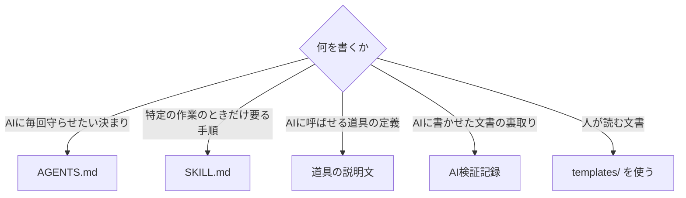

# 08 文書型テンプレート

**この章は、AI向けの文書の型を示す。** 実物は [templates-ai/](../templates-ai/) にある。

## 型の一覧

| 型 | 使う場面 | 従う規則 |
|---|---|---|
| [AGENTS.md](../templates-ai/agents-md.md) | 道具をまたいで使える指示書を書く | `AN-xx` |
| [SKILL.md](../templates-ai/skill.md) | 特定の作業のときだけ読ませる手順を書く | `AK-xx` |
| [道具の説明文](../templates-ai/tool-description.md) | MCP の道具や、関数呼び出しの定義を書く | `AK-xx` |
| [AI検証記録](../templates-ai/ai-review-record.md) | AIに書かせた文書に添える | `AV-xx` |

**本編の型8種は [templates/](../templates/) にある。** 人が読む文書には、そこにある型を使う。

## どの型を使うか

## 指示書とスキルの使い分け

**最も間違えやすいところである。**

| 判断 | 使うもの | 理由 |
|---|---|---|
| 毎回の作業で要る | 指示書（AGENTS.md） | 常に読まれる |
| 特定の作業のときだけ要る | スキル | 関係するときだけ読まれる |
| 特定のファイルを触るときだけ要る | 経路を限った規則 | そのファイルを読むときだけ読まれる |
| **探せば分かる** | **書かない** | AIが自分で調べられる |

**指示書に手順を書き込むと、その手順は毎回読まれる。** 使わない日も読まれる。それが量を増やし、他の指示の遵守を下げる。

**出典**: `SRC-AIEXT-007`、`SRC-AIEXT-003`

## 型を使う前に決めること

本編の [02章](../docs/02-before-writing.md) と同じく、書き始める前に決める。**AI向けでは項目が違う。**

| 決めること | 問い |
|---|---|
| 読者 | 人が読むか、AIが読むか、両方か |
| 読まれる頻度 | 毎回読まれるか、必要なときだけか |
| 切り分けられるか | 検索されて一部だけが渡るか、全体が渡るか |
| **失敗したときに気づけるか** | 守られなかったとき、誰かが気づくか |

**最後の問いが重要である。** 気づけないなら、文書ではなく仕組みで止める（`AN-11`）。

## 型に共通する確認事項

どの型でも、書き終えたら次を確かめる。

1. **その節だけを切り取って、人に見せる。** 答えられるか（`AD-01`）。
2. **矛盾した記述が無いか**（`AN-06`）。
3. **AIが既に知っていることを書いていないか**（`AN-09`）。
4. **守ったかどうかを機械的に確かめられるか**（`AN-05`）。
5. **使う予定のモデルすべてで試したか**（`AK-11`）。

一覧は [付録 チェックリスト](appendix-checklist.md) にある。
