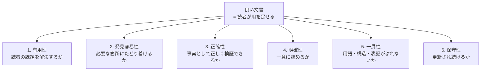

# 良い文書とは何か

## 結論

**良い文書とは、読者が必要な判断と行動を、最小の労力で、正しく行える文書である。**

美しさでも、網羅性でも、分量でもない。読者が用を足せたかどうかだけが基準になる。

この定義から、次の3つが導かれる。

1. **読者が決まらなければ、良し悪しも決まらない。** 誰にとって良いのかを言えない品質評価は成立しない。
2. **読まれない部分は、書かれていないのと同じである。** Webページを対象とした実験では、79%の利用者が新しいページを必ず走査した（`SRC-EXT-002`）。
3. **正しいだけでは足りない。** 正しくても見つからない、正しくても読み解けない文書は、用を足さない。

---

## 品質の6軸

文書の質は1つの尺度では測れない。この標準では6つの軸で見る。**レビューで「なぜダメか」を語るときは、まずこの6軸のどれに当たるかを言う。**

| # | 軸 | 問い | 満たさないと何が起きるか | 主な出典 |
|---|---|---|---|---|
| 1 | **有用性** | 読者の課題を解決するか | 読まれない。または読んでも行動できない | `SRC-WRITE-003` 1.4–1.5、`SRC-EXT-004` |
| 2 | **発見容易性** | 必要な箇所にたどり着けるか | 存在するのに使われない。同じ質問が繰り返される | `SRC-EXT-002`、`SRC-EXT-005` |
| 3 | **正確性** | 事実として正しく、検証できるか | 誤った作業をする。信用を失う | `SRC-WRITE-004` 2-2、`SRC-EXT-005` |
| 4 | **明確性** | 一意に読めるか | 解釈が分かれる。読み返しが増える | `SRC-WRITE-003` 2.1、`SRC-EXT-001` |
| 5 | **一貫性** | 用語・構造・表記がぶれないか | 同じものが別物に見える。検索できない | `SRC-EXT-003`、`SRC-EXT-005` |
| 6 | **保守性** | 更新され続けるか | 古い情報が残り、無い方がましになる | `SRC-EXT-005`、`SRC-EXT-001` |

### 読みやすさはどこにあるか

**「読みやすさ」は独立した品質ではない。** 主に **4. 明確性** の現れであり、一部は **2. 発見容易性** に属する。

この区別は実務で効く。「読みにくい」という指摘は、実際には次のどれかである。

| 「読みにくい」の正体 | 該当する軸 | 直し方 |
|---|---|---|
| 一文に複数の主題が入っている | 明確性 | 文を分ける |
| 係り受けが一意に決まらない | 明確性 | 修飾の順序を変える。読点を打つ |
| 知らない語が定義なしで出てくる | 明確性 | 定義するか言い換える |
| 結論がどこにあるか分からない | 発見容易性 | 結論を先に出す |
| 見出しから中身が予測できない | 発見容易性 | 見出しを具体的にする |
| 同じものが別の名前で呼ばれている | 一貫性 | 用語を統一する |

**「読みにくいです」だけの指摘は、この6つのどれなのかを言っていないので、直しようがない。** レビューの章（[06-review.md](06-review.md)）で詳しく扱う。

---

## 測れる品質と、測れない品質

`SRC-EXT-004`（Diátaxis）は品質を2層に分ける。この標準もその区別を採る。

| 層 | 内容 | 測り方 |
|---|---|---|
| **機能的品質** | 正確さ、完全さ、一貫性、有用性、精密さ | 現実と突き合わせて客観的に測れる。互いに独立している |
| **深い品質** | 使っていて気持ちがよい、流れがある、人の必要に合っている、読者を先回りしている | 数値では測れない。あるかどうかは分かる。互いに依存し合う |

上の6軸は、ほぼ機能的品質にあたる。深い品質はこの標準の規則では作れない。

**このことから、この標準で最も重要な注意点が導かれる。**

> **自動チェッカー（`doc_lint`）を通ったことは、品質の証明ではない。**
> チェッカーが見ているのは機能的品質の、さらに一部だけである。読者に合っているか、結論が妥当か、事実が正しいかは、人間が判断するしかない。

---

## この標準が扱わないこと

範囲を先に切る。扱わないものを書いておかないと、扱っていないことが欠陥に見える。

| 扱わないこと | 理由 |
|---|---|
| **対象領域の事実が正しいかの検証** | 文書の質ではなく、対象領域の知識の問題である。下記の分界を参照 |
| 図の作画技術（配色理論、タイポグラフィの詳細） | 別分野である。図については「いつ使うか」「何を書くか」だけを扱う |
| 特定のツールの操作方法 | ツールは変わる。`SRC-WRITE-002` も「ツールは変わる、Markdownは残る」と述べている |
| 英語の文書の書き方 | 対象読者が日本語話者であるため |

### 「正確性」の責任分界

品質6軸の3番目に正確性がある一方で、事実の検証は扱わないとしている。矛盾に見えるので、境界を書く。

| 誰が見るか | 何を見るか | 例 |
|---|---|---|
| **文書レビュアー**（この標準の範囲） | 事実として**検証できる形**になっているか | 数値に単位と計測方法があるか。事実と推定が分かれているか。出典が示されているか |
| **対象領域の担当者**（この標準の範囲外） | 書かれている事実が**実際に正しいか** | その数値が実測値と合っているか。その設定値が本番と一致しているか |

**文書レビュアーが「この値は間違っている」と言えるのは、その領域を知っている場合だけである。** 知らない場合に言えるのは「この値の出どころが書かれていないので、読者は確かめられない」である。後者はこの標準の範囲であり、Blocker になりうる。

---

## 規範の強さ

この標準のルールには、次の3段階のいずれかが付く。定義は `SRC-EXT-006`（RFC 2119）に合わせる。

| 語 | 対応 | 意味 |
|---|---|---|
| **必須** | MUST | 守らないと読者に実害が出る。**適用範囲の中では例外を認めない** |
| **推奨** | SHOULD | 原則守る。外すなら理由を文書に残す |
| **任意** | MAY | 状況によって選んでよい |

RFC 2119 は、規範語を控えめに使うよう明示している。

> "Imperatives of the type defined in this memo must be used with care and sparingly."

**この標準でも「必須」は最小限にする。** 必須が多い標準は守られない。守られない標準は無い方がましである。

### 「例外」は、適用範囲の定義である

必須のルールにも「例外」の欄がある。これは「守らなくてよい場合がある」という意味ではない。**そのルールが及ばない範囲を書いている。**

たとえば S-05（能動態を使う）の例外は「手順書のシステム側の反応」である。手順書のその部分は、はじめから S-05 の適用範囲の外にある。適用範囲の中では例外を認めない。

**逸脱したいときは、例外ではなく理由を書く。** 推奨・任意のルールを外す場合は、外した理由を文書に残す。必須のルールを外すことはできない。

---

## 出典数と規範度は別の軸である

**この2つを混同しないこと。**

| 軸 | 何を表すか | 決め方 |
|---|---|---|
| **出典数** | その原則が、どれだけ広く支持されているか | 独立した出典が何件、直接支持しているか |
| **規範度** | 守らないと、読者にどれだけ実害が出るか | 品質6軸のどれを、どの程度損なうか |

**単一出典でも、実害が大きければ必須にする。** たとえば S-13（文体を統一する）を支持する出典は `SRC-EXT-003` だけである。それでも必須にしているのは、文体の混在が文書としてのまとまりを壊し、読者が書き手の交代を疑うからである。

**逆に、多くの出典が支持していても、実害が小さければ推奨にとどめる。** S-12（迷ったらひらがなで開く）がその例である。

**したがって、各ルールの出典欄は「どれだけ確からしいか」を、規範度は「どれだけ守るべきか」を示している。** 出典が1件のルールは、その旨が出典欄から読み取れる。

### 出典が無いルール

次のルールには出典が無い。**この標準が運用上の取り決めとして決めたものである。** 各ルールにその旨を明記している。

| ルール | 位置づけ |
|---|---|
| R-06 重大度を付ける | 社内の成果物品質基準に合わせた取り決め |
| R-07 好みと規約を区別して言う | 私見。ただし `SRC-WRITE-003` 3.7 の指針と整合する |
| O-05 消すことも品質改善である | `SRC-EXT-005` の Current 原則から導いた運用上の取り決め |
| O-07 未解決の印を残さない | 運用上の取り決め |

---

## 数値の扱い

この標準にはいくつか数値が出てくる。**すべて単一の出典に由来する目安であり、合否の基準ではない。**

| 対象 | 数値 | 出典 |
|---|---|---|
| 一文の長さ | 50字以内 | `SRC-WRITE-003` 2.3 |
| 段落の文数 | 3〜5文、7文を超えない | `SRC-EXT-001` |
| 箇条書きの項目数 | 7項目以内 | `SRC-WRITE-003` 4.7 |
| 説明のポイント数 | 3つまで | `SRC-WRITE-001` 第2章 |
| 見出しの階層 | 3階層程度まで | `SRC-WRITE-003` 4.6 |
| 手順のステップ数 | 10ステップ以内 | `SRC-WRITE-003` 5.3–5.6 |

**数値を超えたことは、違反ではなく合図である。** 「ここに複数の主題が入っていないか」を見直すきっかけとして使う。

数値だけを守った結果、内容が抜け落ちるのは本末転倒である。`SRC-WRITE-003` 自身がこう書いている。

> 簡潔な文というのは、内容がない短い文とは異なります。

---

## 次に読むもの

- 書き始める前に決めることは [02-before-writing.md](02-before-writing.md) にある。
- 自分の「読みやすさ」の感覚が正しいか確かめたい場合は [09-your-instincts.md](09-your-instincts.md) を先に読んでよい。
