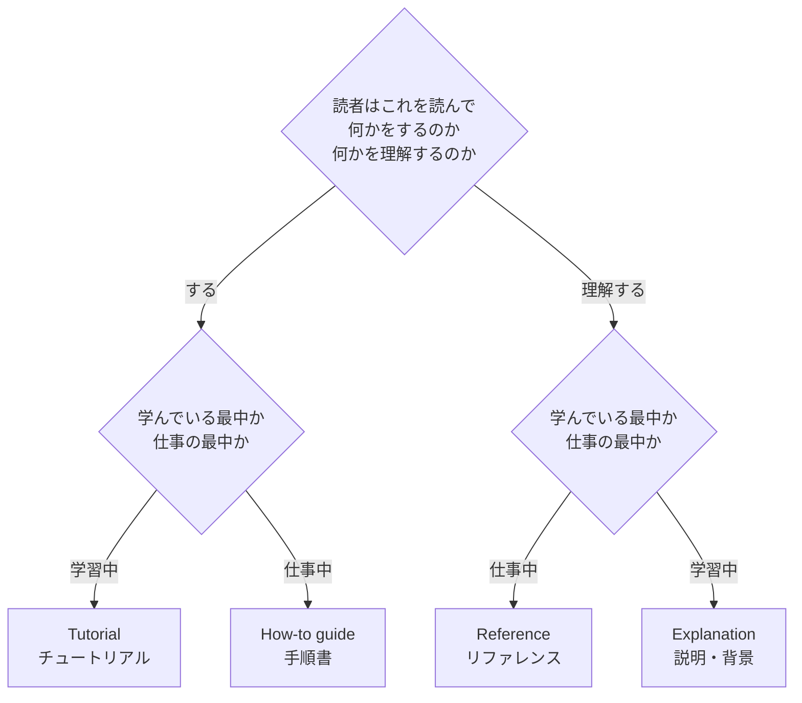
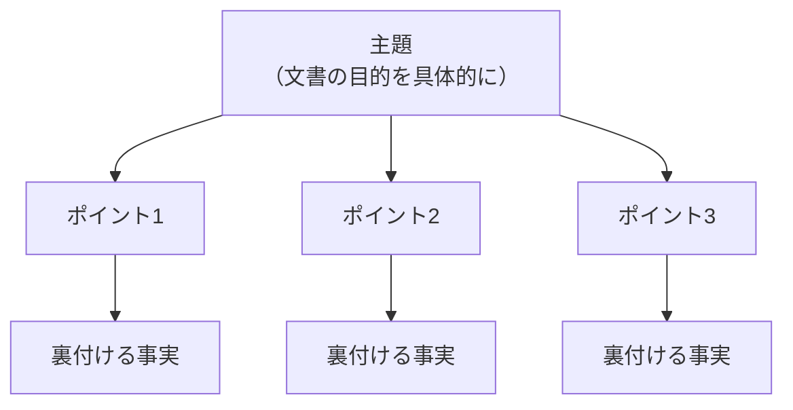

# 書き始める前に決めること

## 結論

**書き始める前に6つを決める。決まっていないうちは書かない。**

1. 読者は誰か
2. 読んだあと、読者に何をしてほしいか
3. この文書はどの型か
4. 何を扱い、何を扱わないか
5. 誰がいつまで面倒を見るか
6. どこまで共有してよいか（機密区分）

**この5つが決まっていない文書は、あとでいくら文を直しても良くならない。** レビューで「読みにくい」と言われる文書の多くは、ここが決まっていない。


---

## B-01 読者を具体的に決める

**規範度: 必須**

**なぜ（有用性）**: 読者が決まらなければ、必要な情報も、使える言葉も、書く分量も決まらない。**「関係者全員」は読者ではない。**

**決めること**

| 項目 | 例 |
|---|---|
| 役割 | 運用担当者 / 開発者 / 顧客の業務担当者 / 半年後の自分 |
| 前提知識 | このシステムの構成を知っているか。SQLを読めるか |
| 読む状況 | 障害対応中に急いで読むのか、設計レビューでじっくり読むのか |
| 読む動機 | 自分で探して来たのか、読めと言われて来たのか |

**読む状況は特に重要である。** 障害対応中に読まれる手順書と、設計レビューで読まれる設計書では、同じ内容でも書き方が変わる。

**読者が複数いる場合**は、**主たる読者を1つに決める。** 副次的な読者向けの情報は、別の節か別紙に分ける。1つの文書ですべての読者を満たそうとすると、誰にとっても長い文書になる。

**出典**: `SRC-WRITE-003` 1.4、`SRC-WRITE-004` 1-1、`SRC-EXT-001`

---

## B-02 読んだあとの行動を一文で書く

**規範度: 必須**

**なぜ（有用性）**: 目的が曖昧だと、読者は読み終えても何もしない。文書の存在意義は、読者の行動が変わることにある。

**書き方**: 「この文書を読んだあと、〈読者〉は〈何〉ができるようになる」の形で書く。

| 悪い目的 | 良い目的 |
|---|---|
| システムの概要を説明する | 運用担当者が、バッチ処理の異常終了時に、自力で再実行できるようになる |
| 設計を共有する | レビュー参加者が、A案とB案のどちらを採るか判断できるようになる |
| 障害を報告する | 顧客が、再発しないと納得し、追加の対応が不要だと判断できる |

**この一文は、文書の冒頭に書く。** 書けないなら、その文書はまだ書けない。

**出典**: `SRC-WRITE-003` 1.5、`SRC-WRITE-001` 第1章、`SRC-WRITE-004` 1-2

---

## B-03 文書の型を決める

**規範度: 必須**

**なぜ（有用性・発見容易性）**: **型を混ぜることが、文書の質を落とす最大の原因である。** 手順の途中に設計の背景が入ると、急いでいる読者は手順を追えなくなる。

`SRC-EXT-004`（Diátaxis）は、2つの問いで型を決める。



| 型 | 目的 | 読者の状態 | 書いてよいこと | 書いてはいけないこと |
|---|---|---|---|---|
| **Tutorial** | 技能を身につけさせる | 何も知らない。学習中 | 必ず成功する一本道の手順 | 選択肢、例外、設計の背景 |
| **How-to guide** | 目の前の問題を解決させる | ある程度知っている。作業中 | 目的別の手順、前提条件 | 基礎の説明、なぜそうするかの長い説明 |
| **Reference** | 事実を正確に引かせる | 作業中。特定の項目を探している | 網羅的な事実、仕様、一覧 | 手順、意見、おすすめ |
| **Explanation** | 背景を理解させる | 学習中。全体像を知りたい | 設計思想、経緯、代替案、トレードオフ | 手順、細かい仕様値 |

### 社内文書への当てはめ

Diátaxis は公開文書を想定しており、社内文書はきれいに収まらない。**無理に当てはめず、「主たる型は何か」「混ざっているのはどこか」を問う道具として使う。**

| 社内文書 | 主たる型 | よく混ざるもの |
|---|---|---|
| README | How-to（導入手順） | 設計の背景（Explanation）が混ざりがち |
| 設計書 | Explanation（なぜこうしたか） | 仕様の一覧（Reference）が混ざりがち |
| API仕様書 | Reference | 使い方の例（How-to）が混ざりがち |
| 運用手順書 | How-to | システムの説明（Explanation）が混ざりがち |
| 障害報告書 | Reference（事実）＋ Explanation（原因） | 意見が事実に混ざりがち |
| 議事録 | Reference（決定事項） | 議論の経過（Explanation）が混ざりがち |

**混ざること自体が悪いのではない。混ざったまま区別がついていないことが悪い。** 見出しで分ければよい。

**出典**: `SRC-EXT-004`、`SRC-WRITE-003` 5.5–5.7、`SRC-WRITE-004` 2-3

---

## B-04 扱わないことを書く

**規範度: 推奨**

**なぜ（有用性）**: 範囲が書かれていないと、扱っていないことが「欠落」に見える。読者は無いものを探し続ける。

`SRC-EXT-005` の `Complete` 原則が根拠になる。

> "Within each publication, cover concepts in full, or not at all."

半端に扱うくらいなら扱わない方がよい。そのためには、**扱わないと宣言する必要がある。**

**書き方の例**

```markdown
## この文書の範囲

扱うこと:
- 本番環境でのバッチ再実行の手順

扱わないこと:
- バッチが失敗する原因の調査方法（→ `runbook-batch-troubleshoot.md`）
- 開発環境での実行（環境変数が異なる）
```

**扱わないことには、行き先を書く。** 「扱わない」だけだと読者は途方に暮れる。

**出典**: `SRC-EXT-005`、`SRC-WRITE-003` 1.4

---

## B-05 保守の責任者と最終確認日を書く

**規範度: 必須**

**なぜ（保守性）**: 誰の持ち物でもない文書は必ず腐る。

`SRC-EXT-005` の `Current` 原則は、腐った文書の害をはっきり書いている。

> "Consider incorrect documentation to be worse than missing documentation."

**誤った文書は、文書が無いことより悪い。** 読者は書いてあることを信じて作業するからである。

**書き方**: 文書の冒頭か末尾に次を置く。

```markdown
| 項目 | 内容 |
|---|---|
| 保守責任者 | 〇〇（チーム名でも可） |
| 最終確認日 | 2026-08-28 |
| 次回確認予定 | 2026-11-28 |
```

**「最終更新日」ではなく「最終確認日」にする。** 更新が無くても、内容がまだ正しいことを確認したという意味を持たせる。

**出典**: `SRC-EXT-005`、`SRC-EXT-001`（timeless documentation）

---

## B-06 書く前に構造を組む

**規範度: 推奨**

**なぜ（明確性）**: 先に構造を作ると、情報の漏れと重複が書く前に見つかる。文を書いてから構造を直すと、書いた文が無駄になる。

`SRC-WRITE-003` 1.6 は、3階層のロジックツリーを勧めている。



| 階層 | 入れるもの | 数の目安 |
|---|---|---|
| 第1階層 | 主題。文書の目的を具体的に書く | 1つ |
| 第2階層 | 読者の視点で立てたポイント | **3〜4つに絞る** |
| 第3階層 | ポイントを裏付ける具体的な事実 | ポイントごとに必要な分 |

**第2階層は読者の疑問の形で立てる。** 障害報告書なら「何が起こったのか」「原因は何なのか」「どう対処したのか」「今後はどう取り組むのか」になる。

**書き手の都合で章立てをすると、読者の疑問に答えない文書ができる。**

**出典**: `SRC-WRITE-003` 1.6

---

## B-07 機密区分を決め、載せてよい情報を先に決める

**規範度: 必須**

**なぜ（正確性・有用性）**: 文書は共有されるために書く。**共有された瞬間に取り消せない情報がある。** 障害報告書に本番の接続文字列が入っていれば、報告した相手全員がそれを持つ。

**書く前に決める。** 書いたあとに消すのでは間に合わない。Git の履歴にも残る。

### 区分

| 区分 | 内容 | 置き場所 |
|---|---|---|
| **公開可** | 外部に出しても害がない | どこでもよい |
| **社内限** | 社内の構成、内部の呼称、未公表の予定 | 社内のリポジトリ・共有場所 |
| **限定共有** | 顧客名、契約条件、個人が特定できる情報 | 権限を絞った場所。**閲覧者を列挙できること** |
| **載せない** | 認証情報、秘密鍵、本番データそのもの | **文書に書かない。** 保管場所への参照だけを書く |

### 絶対に文書へ書かないもの

- パスワード、APIキー、トークン、秘密鍵、接続文字列
- 本番データそのもの（顧客名、メールアドレス、電話番号、注文明細）
- 個人が特定できるログ

**「開発用だから」「もう無効にしたから」も理由にならない。** 無効化の確認は読者にはできない。

### 画面キャプチャとログの扱い

**キャプチャは、写っているものすべてを共有している。** 本文で触れていない部分も含まれる。

| 対象 | やること |
|---|---|
| 画面キャプチャ | 貼る前に、URL・ヘッダー・通知・他のタブ・氏名欄を確認する。隠すのではなく**撮り直す**か、必要部分だけを切り出す |
| ログ | ID・メールアドレス・トークンを置換する。置換したことを本文に書く |
| 実行例 | 実在の値を使わない。`example.com`、`user@example.com`、`REDACTED` を使う |

**黒塗りで隠さない。** 画像の上に黒い四角を重ねただけの加工は、元データが残る形式では復元できることがある。

### 文書に区分を書く

冒頭のメタ情報に1行足す。

```markdown
| 機密区分 | 社内限 |
```

**区分が書かれていない文書は、受け取った人がどう扱ってよいか分からない。**

**出典**: **出典なし・運用上の取り決め**。手元の4冊と外部6出典のいずれも、機密情報の扱いを扱っていない。**この標準の弱いところである。** 組織に情報取扱規程があるなら、そちらが優先される。

---

## この章のチェックリスト

書き始める前に、次に答えられるか確認する。

**読者と目的**

- [ ] 主たる読者を1つに決めたか
- [ ] 読者の前提知識と、読む状況を書き出したか
- [ ] 「読んだあと読者は〇〇ができる」を一文で書けるか
- [ ] この文書の主たる型（Tutorial / How-to / Reference / Explanation）を決めたか

**範囲と運用**

- [ ] 扱わないことと、その行き先を書いたか
- [ ] 保守責任者と最終確認日を決めたか
- [ ] 機密区分を決めたか。載せてはいけない情報を確認したか
- [ ] 第2階層のポイントを3〜4つに絞ったか

**1つでも答えられないなら、書き始めない。**

## この章のルール一覧

| ID | ルール | 規範度 |
|---|---|---|
| B-01 | 読者を具体的に決める | 必須 |
| B-02 | 読んだあとの行動を一文で書く | 必須 |
| B-03 | 文書の型を決める | 必須 |
| B-04 | 扱わないことを書く | 推奨 |
| B-05 | 保守の責任者と最終確認日を書く | 必須 |
| B-06 | 書く前に構造を組む | 推奨 |
| B-07 | 機密区分を決め、載せてよい情報を先に決める | 必須 |
