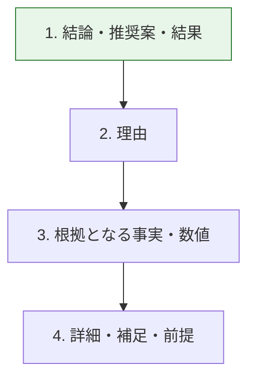

# 構成のルール

## 結論

**読者は最初から順に読まない。**

Webページを対象とした実験では、79%の利用者が新しいページを必ず走査し、1語ずつ読んだのは16%だった（`SRC-EXT-002`）。

**この数値はWebページの測定であり、社内の設計書や手順書では測られていない。** それでも、走査を前提にした書き方が理解を助けるという方向は、`SRC-WRITE-001`・`SRC-WRITE-003`・`SRC-EXT-005` とも一致する。**数値は根拠として使い、比率としては使わない。**

したがって構成の目的はただ一つである。**どこで読むのをやめても、要点が伝わるようにする。**

---

## C-01 結論を先に書く

**規範度: 必須**

**なぜ（有用性・発見容易性）**: 起承転結で書くと、結論まで読まなければ要点が分からない。走査する読者は、要点にたどり着く前に読むのをやめることがある。

`SRC-EXT-002` は逆ピラミッド型の効果を4つ挙げている。

- 理解を助ける。読者が早く全体像を作れる
- 読む労力を減らす。長く読まなくても要点が分かる
- 読み進めさせる
- **途中でやめる読者を支える**

**書く順序**



**Before**

```text
昨日、6月4日（月）から「FinTech フォーラム」が始まり、出展者としてブースを担当
しましたので、その状況についての報告とともに、他社ブースの内容も含めたフォーラム
全体の状況について報告させていただきます。
```

**After**

```text
昨日、6月4日（月）から始まった「FinTech フォーラム」のブースでの出展と、
全体の状況を報告いたします。
```

**例外がある。** `SRC-WRITE-001` 第4章は、次の場合に結論を後ろに置いてよいとしている。

| 場面 | 理由 |
|---|---|
| 交渉 | 先に結論を出すと相手が構えてしまう |
| 相手にとって不利な内容 | 経緯を先に示さないと納得されない |
| 期待感を持たせたい提案 | 課題の共有を先に済ませる |

**ただし、技術文書では原則として結論が先である。** 例外を使うときは、それが交渉や説得の文書であることを自覚して使う。

### C-01 の適用単位と、C-10 との優先関係

**C-01 は文書の先頭に適用する。** 文書の冒頭に、結論・決定・結果を置く。

**その下の本体の並びは C-10（文書型ごとの構成）に従う。** 両者が衝突したら **C-10 が勝つ。**

| 文書型 | 冒頭（C-01） | 本体の並び（C-10） |
|---|---|---|
| ADR | 決定を1文で書く | 状況 → 決定 → 理由 → 結果と影響 |
| 障害報告書 | 何が起きて、いまどうなっているかを1文で書く | 障害内容 → 障害原因 → 再発防止策 |
| 調査報告 | 結論と推奨を1文で書く | 調査依頼 → 方法 → 結論 → 推奨事項 → 注意事項 |

**理由はこうである。** 文書型の構成は、読者の疑問の順序に合わせて出典が定めたものである。その順序を崩すと、読者は前提を知らないまま結論を読むことになる。一方、走査する読者には冒頭の1文が要る。**両方を満たすには、冒頭に要約を置き、本体は型の順序に従う。**

**出典**: `SRC-WRITE-003` 3.1、`SRC-WRITE-004` 2-2、`SRC-WRITE-001` 第2章・第4章、`SRC-EXT-002`

---

## C-02 見出しは、内容を予測できる具体的な言葉にする

**規範度: 必須**

**なぜ（発見容易性）**: 見出しは走査する読者にとっての入口である。中身が予測できない見出しは、入口として機能しない。

`SRC-EXT-002` は、実験結果からこう述べている。

> "meaningful **sub-headings** (not 'clever' ones)"

**気の利いた見出しにしない。意味のある見出しにする。**

| 使わない見出し | 直した見出し |
|---|---|
| その他 | 制限事項と既知の不具合 |
| 補足 | 本番環境と開発環境の差分 |
| 詳細 | バッチ再実行時のパラメータ一覧 |
| はじめに | この文書の読み方と対象読者 |
| 考察 | 再発防止策を3案から1案に絞った理由 |

**見出しだけを上から読んで、文書の筋が通るか確かめる。** 通らないなら構成が悪い。

### 見出しの書き方の規則

| # | 規則 | 出典 |
|---|---|---|
| 1 | 作業の見出しは動詞で書く（「バッチを再実行する」） | `SRC-EXT-001` |
| 2 | 概念の見出しは名詞句で書く（「バッチ処理の構成」） | `SRC-EXT-001` |
| 3 | 見出しの文末に句点（。）を付けない | `SRC-EXT-003` 1.1.2 |
| 4 | 見出しの文体を統一する（体言止め / 常体 / 「〜には」のどれかに揃える） | `SRC-EXT-003` 1.1.2 |
| 5 | 見出しに句読点が増えたら、見出しが複雑すぎる合図 | `SRC-EXT-001` |
| 6 | 見出しにリンクを置かない | `SRC-EXT-001` |
| 7 | 見出しに番号を振って順序を示さない（Markdownの見出しでは） | `SRC-EXT-001` |

---

## C-03 見出しの階層を飛ばさない。空の見出しを作らない

**規範度: 必須**

**なぜ（発見容易性・一貫性）**: 階層は文書の構造そのものである。飛ばすと構造が壊れ、目次が正しく作れない。

**やってはいけない例**

```markdown
## 障害の概要

### 発生日時          ← ここまではよい

##### 影響範囲        ← h3 から h5 へ飛んでいる
```

**空の見出しも作らない。**

```markdown
## 再発防止策

### 短期対策          ← 見出しの直後に本文が無く、すぐ次の見出しが来る
#### 監視の追加
```

**直す**: 見出しの直後には、その節の要約を1〜2文置く。走査する読者は、その1文で読むかどうかを決める。

**これは `doc_lint` が自動検出する。**

**出典**: `SRC-EXT-001`、`SRC-WRITE-002` 7.1.3

---

## C-04 階層は3階層程度までにする

**規範度: 推奨**

**なぜ（発見容易性）**: 深い階層は、項目間の関係と全体像を把握しにくくする。

`SRC-WRITE-003` 4.6 は、長文の文書でも**章・節・項の3階層程度まで**に制限するよう求めている。

**4階層以上が必要になったときは、たいてい次のどちらかである。**

1. 1つの文書に2つ以上の文書が入っている → 分割する
2. 分類が細かすぎる → まとめる

**出典**: `SRC-WRITE-003` 4.6

---

## C-05 情報の型を混ぜない

**規範度: 必須**

**なぜ（明確性・有用性）**: 手順を追っている読者にとって、途中の背景説明は妨害である。`SRC-EXT-004` は、混ざることの害を2つ挙げている。

1. 読者の目的が相反するため、読む流れが途切れる
2. 文体と内容が不適切な場所に入り込み、情報の欠落や重複に気づけなくなる

**同じページの中でも、型ごとに節を分ける。**

**Before（混ざっている）**

```markdown
## バッチの再実行手順

1. 管理画面にログインする。
   なお、この管理画面は2023年の基盤刷新でSpring Bootに移行しており、
   認証はOIDCに変更されている。旧来のBasic認証は廃止された。
2. ジョブ一覧から対象を選ぶ。
```

**After（分けた）**

```markdown
## バッチの再実行手順

1. 管理画面にログインする。
2. ジョブ一覧から対象を選ぶ。

## 補足: 管理画面の認証方式

2023年の基盤刷新で Spring Boot に移行し、認証を OIDC に変更した。
旧来の Basic 認証は廃止されている。
```

**効果**: 急いでいる読者は手順だけを追える。背景を知りたい読者は補足を読める。**どちらも消していない。置き場所を変えただけである。**

**出典**: `SRC-EXT-004`、`SRC-WRITE-003` 5.5–5.8、`SRC-WRITE-004` 2-3

---

## C-06 条件は指示の前に置く

**規範度: 必須**

**なぜ（有用性）**: 条件が後ろにあると、読者は指示を実行してから「自分には当てはまらなかった」と気づく。

`SRC-EXT-001`（highlights）の規則である。

> "Put conditions before instructions, not after"

**Before**

```text
[再実行] をクリックしてください。ただし、ジョブの状態が FAILED の場合に限ります。
```

**After**

```text
ジョブの状態が FAILED の場合は、[再実行] をクリックしてください。
```

**注意文でも同じである。** `SRC-WRITE-003` 5.8 は、**守るべき操作を先に書き、理由を別文で続ける**よう求めている。

**Before**

```text
▲注意▲
一度削除を実行したファイルを復活することはできないので、ファイルを削除するときは、
確認メッセージとともに表示されるファイル名を確認してから実行してください。
```

**After**

```text
▲注意▲
ファイルを削除するときは、確認メッセージとともに表示されるファイル名を確認してから
実行してください。削除したファイルは復活できません。
```

**出典**: `SRC-EXT-001`、`SRC-WRITE-003` 5.8

---

## C-07 一度に示す項目は絞る

**規範度: 推奨**

**なぜ（明確性）**: 人が一度に把握できる項目数には限りがある。

| 対象 | 目安 | 根拠 |
|---|---|---|
| 説明のポイント | **3つまで** | 短期記憶 4±1（`SRC-WRITE-001` 第2章） |
| 箇条書きの項目 | **7項目以内** | マジックナンバー7、認知心理学（`SRC-WRITE-003` 4.7） |
| ロジックツリー第2階層 | **3〜4つ** | `SRC-WRITE-003` 1.6 |
| 段落の文数 | **3〜5文、7文超えない** | `SRC-EXT-001` |
| 手順のステップ | **10ステップ以内** | `SRC-WRITE-003` 5.3–5.6 |

**超えたときの対処**（`SRC-WRITE-003` 4.7）

1. グループ化して全体を分ける
2. 優先度の高い項目に絞る

**「全部書く」は親切ではない。** 読者が把握できない量を出すと、結果として何も伝わらない。

**出典**: `SRC-WRITE-001` 第2章、`SRC-WRITE-003` 1.6、4.7、5.3–5.6、`SRC-EXT-001`

---

## C-08 文書に必須の4要素を入れる

**規範度: 必須**

**なぜ（発見容易性・保守性）**: 「いつ、誰に、誰が、何のために」が無い文書は、あとから探せず、信頼度も判断できない。

`SRC-WRITE-003` 4.1–4.2 が挙げる必須要素は次の4つである。

| 要素 | 役割 |
|---|---|
| 発信日 | いつ時点の情報か |
| 宛先 | 誰に向けた文書か |
| 発信者名 | 誰が責任を持つか |
| タイトル | 何の文書か |

**タイトルには対象と目的を示す具体的なキーワードを入れる**（`SRC-WRITE-003` 2.5）。

| 使わない | 直した |
|---|---|
| 障害の件 | 販売管理システム ファイル共有機能の障害報告と再発防止策 |
| 打ち合わせについて | 12/3 決済基盤リプレース 設計方針レビューのお願い |
| 調査結果 | バッチ処理遅延の原因調査結果とインデックス追加の提案 |

**「〜について」「〜の件」だけでは、開かないと中身が分からない。** 検索でも見つからない。

**出典**: `SRC-WRITE-003` 2.5、4.1–4.2

---

## C-09 走査できるようにする

**規範度: 必須**

**なぜ（発見容易性）**: 読者は走査する。走査できない文書は、その読者にとって存在しないのと同じである。

`SRC-EXT-002` が挙げる走査可能な文章の要素は4つである。

| 要素 | 具体的にやること |
|---|---|
| キーワードの強調 | 重要な語を太字にする。リンクも強調として働く |
| 意味のある小見出し | C-02 のとおり |
| 箇条書き | 並列する情報は箇条書きにする |
| 1段落1アイデア | 読者は最初の数語で判断し、残りを飛ばす |

`SRC-EXT-005` の `Skimmable` も同じことを求めている。

> "Save your readers' time by writing like a newspaper instead of a novel."

**小説ではなく新聞のように書く。**

**出典**: `SRC-EXT-002`、`SRC-EXT-005`

---

## C-10 文書型ごとの構成に従う

**規範度: 推奨**

**なぜ（有用性）**: 読者の疑問の順序は、文書の型によって決まっている。その順序に合わせる。

| 文書 | 構成 | 出典 |
|---|---|---|
| 障害報告書 | 障害内容 → 障害原因 → 再発防止策 | `SRC-WRITE-003` 7.4–7.5 |
| 調査報告 | 調査依頼 → 方法 → 結論 → 推奨事項 → 注意事項 | `SRC-WRITE-004` 3-1 |
| 進捗報告 | 規模 → 客観的原因 → 対策 → 回復見込み | `SRC-WRITE-004` 3-2〜3-3 |
| 会議通知 | 日時 → 場所 → 参加者 → 目的 → 議題 → 事前準備 | `SRC-WRITE-004` 3-4 |
| 議事録 | 既決事項（担当者・期限つき） → 未決事項 | `SRC-WRITE-004` 3-5 |
| 作業指示 | 背景・目的 → 方針 → 締め切り → その後の段取り | `SRC-WRITE-004` 6-4、6-6〜6-7 |
| ADR | 状況 → 決定 → 理由 → 結果・影響 | `SRC-EXT-006` |
| 運用手順書 | 適用条件 → 実行前の確認 → 手順 → 確認方法 → 戻し方 | `SRC-WRITE-003` 5.3–5.8 |

**この表に無い文書型（README、設計書、API仕様書）には、C-10 の対象となる構成基準が無い。** 出典が順序を定めていないためである。これらは B-03（文書の型を決める）と C-01（結論を先に書く）に従えばよく、節の並びは内容に合わせて決める。

テンプレートは [templates/](../templates/) にある。

**出典**: `SRC-WRITE-003` 第5〜8章、`SRC-WRITE-004` 第3〜6部

---

## この章のルール一覧

| ID | ルール | 規範度 |
|---|---|---|
| C-01 | 結論を先に書く | 必須 |
| C-02 | 見出しは、内容を予測できる具体的な言葉にする | 必須 |
| C-03 | 見出しの階層を飛ばさない。空の見出しを作らない | 必須 |
| C-04 | 階層は3階層程度までにする | 推奨 |
| C-05 | 情報の型を混ぜない | 必須 |
| C-06 | 条件は指示の前に置く | 必須 |
| C-07 | 一度に示す項目は絞る | 推奨 |
| C-08 | 文書に必須の4要素を入れる | 必須 |
| C-09 | 走査できるようにする | 必須 |
| C-10 | 文書型ごとの構成に従う | 推奨 |
