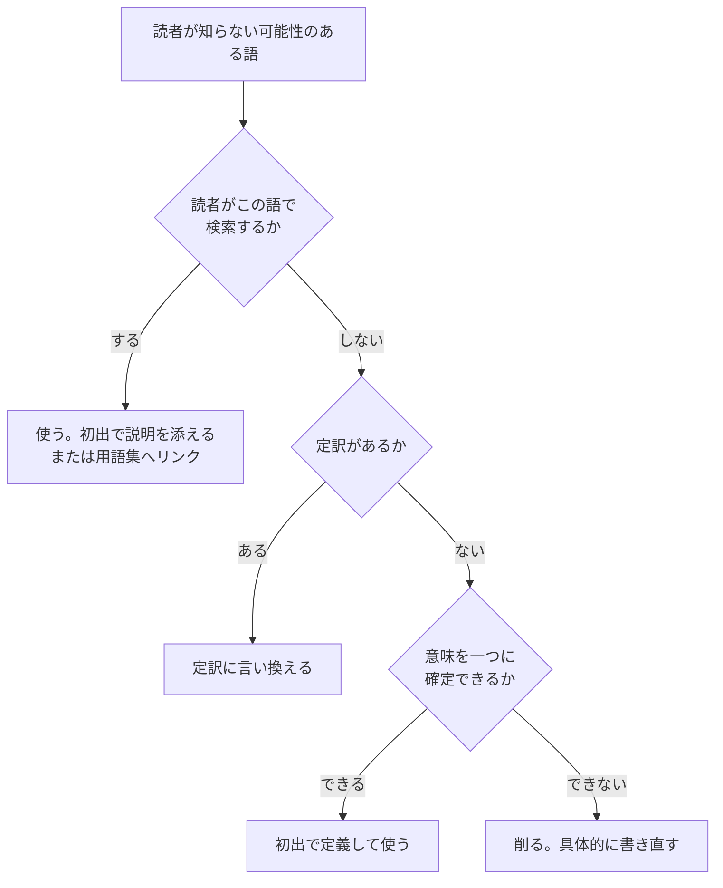
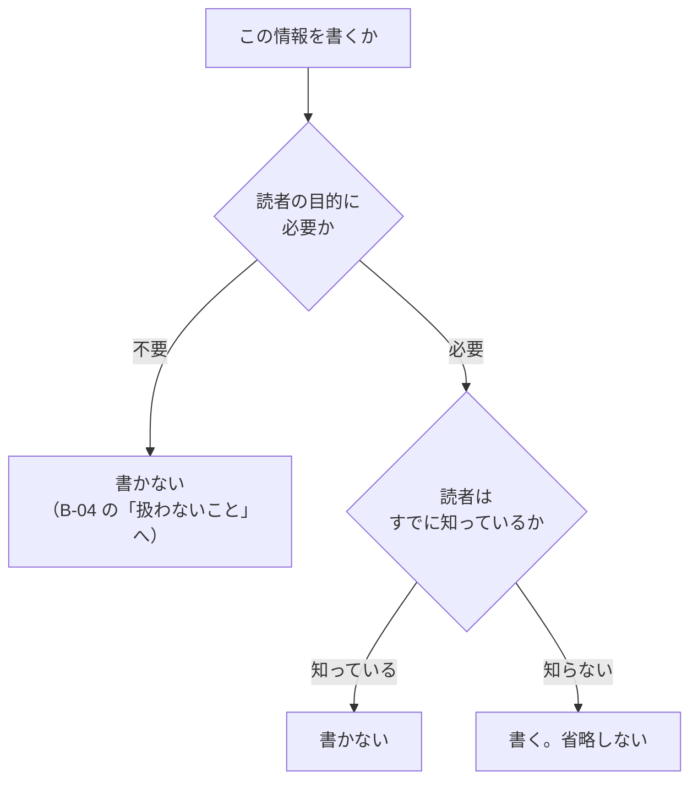

# 文のルール

## この章の位置づけ

**ここは最後に効く章であって、最初に手を付ける章ではない。**

文をいくら磨いても、読者が違えば伝わらない。構成が悪ければ見つからない。順序は次のとおりである。

1. 読者と目的を決める（[02-before-writing.md](02-before-writing.md)）
2. 構成を決める（[03-structure.md](03-structure.md)）
3. **文を書く（この章）**
4. 表記を整える

**この順序を逆にすると手戻りが出る。** 表記を整えたあとに構成を変えると、整えた作業が無駄になる。

## ルールの読み方

各ルールは同じ形で書いている。

- **規範度**: 必須 / 推奨 / 任意（定義は [01-what-is-good.md](01-what-is-good.md#規範の強さ)）
- **なぜ**: 守らないと読者に何が起きるか。品質6軸のどれに当たるか
- **Before / After**: 実例
- **例外**: このルールを適用しない場面
- **出典**: 根拠

---

## S-01 一つの文には一つのことだけを書く

**規範度: 必須**

**なぜ（明確性）**: 読者は句点まで内容を記憶し続け、句点で消化する。主題が複数あると、読者は「どこで区切るか」を自分で判断しながら読むことになり、負荷がかかる。

**Before**

```text
「HRTN CLOUD」はクラウド型ビジネスコミュニケーションツールで、ファイル管理、
プロジェクト管理、メッセンジャー、グループチャット機能をもっているため、資料や
プロジェクトの情報を共有し、コミュニケーションの迅速化を図ることができます。
```

**After**

```text
「HRTN CLOUD」はクラウド型ビジネスコミュニケーションツールです。
ファイル管理、プロジェクト管理、メッセンジャー、グループチャットなどの機能があります。
資料やプロジェクトの情報を共有し、コミュニケーションの迅速化を図ることができます。
```

**効果**: 3つの主題（何であるか / 何ができるか / 何の役に立つか）が分かれ、それぞれ独立して理解できる。

**例外**: なし。

**出典**: `SRC-WRITE-003` 2.1、`SRC-WRITE-001` 第2章、`SRC-WRITE-004` 2-1、`SRC-EXT-001`

---

## S-02 一文は50字を目安にする

**規範度: 推奨（目安であり、合否の基準ではない）**

**なぜ（明確性）**: 50字は「文の区切りまで一気に読め、認知しやすい情報量」とされる。ただし**この数値を挙げている出典は1つだけである。** 他の出典は数値を持たない。

**使い方**: 50字を超えたことを違反としない。**「主題が複数入っていないか」を見直す合図**として使う。

**数え方の目安**（`SRC-WRITE-003` 2.3）

| 環境 | 目安 |
|---|---|
| Word の A4 横書き（1行40字） | 1行＋10字。2行を超えたら80字以上 |
| メール | 画面で3行以上になっていないか |

**例外**: 定義文、条件を列挙する文、引用など、切ると意味が変わる文。

**出典**: `SRC-WRITE-003` 2.3

---

## S-03 「〜（だ）が」「〜ので」で文をつながない

**規範度: 推奨**

**なぜ（明確性）**: この2つの接続は、いくらでも文をつなげてしまう。さらに悪いことに、**最も伝えたい内容が文末に移動する。**

**Before**

```text
チャットやメッセンジャー機能は、個人のユーザーを中心にネット時代の新しいコミュニ
ケーションツールとして普及していますが、データ管理面やセキュリティーの面で企業で
の利用には不安な点もあると考えられているのが実情です。
```

**After**

```text
チャットやメッセンジャー機能のビジネス利用は、データ管理やセキュリティーの面から
不安視されています。
```

**効果**: 106字が49字になり、伝えたいこと（不安視されている）が主節に来た。

**例外**: 順接の「ので」が短く、因果が明確な場合。

**出典**: `SRC-WRITE-003` 2.2

---

## S-04 動作主を明示する

**規範度: 必須**

**なぜ（明確性・有用性）**: 誰がやるのかが書かれていない文は、読者が次の行動を決められない。「調整します」は、誰が調整するのかが分からなければ作業が止まる。

**Before**

```text
次回の打ち合わせは来週の水曜日くらいとの話になったが、その日は先方担当者の都合が
悪いかもしれないとの話になり、結局、その場では決められなかったため、後日調整しま
しょうという話になった。
```

**After**

```text
後日、当方○○が先方××様と日程調整することで合意した。
```

**効果**: 誰が、誰と、何をするかが確定した。85字が27字になったのは結果である。

**例外**: 動作主が文脈から一意に決まり、繰り返しがくどくなる場合。

**出典**: `SRC-WRITE-004` 2-5、`SRC-EXT-001`

---

## S-05 報告・提案・依頼では能動態を使う

**規範度: 推奨**

**なぜ（明確性・正確性）**: 受け身は主体性と責任の所在をぼかす。文字数も増える。

**Before**

```text
データベースの不具合によって、そのトラブルは引き起こされた。（30字）
```

**After**

```text
データベース不具合によりトラブル発生（18字）
```

**例外（重要）**: **手順書では、システム側の結果を受動態で書く。**

`SRC-WRITE-003` 3.4 は、手順を書くときに**利用者の操作は能動態、システムの反応は受動態**で書き分けるよう求めている。動作主が違うので、書き分けた方が一文一義になる。

```text
[保存] をクリックします。          ← 利用者の操作（能動）
設定が保存されます。               ← システムの反応（受動）
```

これは `SRC-WRITE-004` や `SRC-EXT-001` が「受動態を避けよ」と言うのと矛盾しない。**文書の型が違えば規則も違う。**

**出典**: `SRC-WRITE-004` 2-2、2-6、`SRC-WRITE-003` 3.4、`SRC-EXT-001`

---

## S-06 二重否定を使わない

**規範度: 推奨**

**なぜ（明確性）**: 否定が重なると、読者は「結局どうすればよいのか」を自分で反転して考えることになる。

**Before**

```text
フィルタリングソフトを適切に使わないと、青少年が有害サイトを閲覧することを防げま
せん。
```

**After**

```text
フィルタリングソフトを適切に使えば、青少年が有害サイトを閲覧することを防げます。
```

**例外**: 禁止事項を強調する場合（「〜してはならない」は否定1つなので該当しない）。

**出典**: `SRC-WRITE-003` 3.3

---

## S-07 曖昧な語を、数値・固有名詞・日時に置き換える

**規範度: 必須**

**なぜ（正確性・明確性）**: 曖昧な語は、書き手と読者で違う意味に読める。読者は自分の解釈で動くので、間違った作業が起きる。

**置き換えの対象**

<!-- doclint-disable vague_words timeless -->

| 曖昧な語 | 置き換える先 |
|---|---|
| 適切に、必要に応じて、可能な限り | 具体的な条件と手順 |
| 速やかに、早めに、なるべく早く | 日時（年月日と時刻） |
| 大量の、多数の、十分な | 数値と単位 |
| 一部の、複数の | 対象の固有名詞、または件数 |
| 最近、今後、現在 | 日付、または版数 |

<!-- doclint-enable -->

**Before**

```text
あの打ち合わせの内容、早めにまとめてください。
```

**After**

```text
昨日の営業部の打ち合わせの内容を、今日の17時までにA4用紙1枚にまとめてください。
```

**効果**: 何を、いつまでに、どの分量で作るかが確定した。

**例外**: 意図的に幅を持たせる場合（見積りの範囲など）。その場合は**幅であることを明示する**（「3〜5営業日」）。

**出典**: `SRC-WRITE-003` 2.4、3.5、`SRC-WRITE-004` 2-5、`SRC-WRITE-001` 第2章

---

## S-08 「など」を安易に使わない

**規範度: 推奨**

**なぜ（正確性）**: 「など」は、ほかに何があるのかを読者に分からなくする。書き手が列挙をやめたいときに使われることが多い。

**Before**

```text
本体のカバーを開けるときは、ボックスの四隅にあるネジを緩めてから開けます。
ドライバーやレンチなどを用意してください。
```

**After**

```text
本体のカバーを開けるときは、ボックスの四隅にあるネジを緩めてから開けます。
ドライバーやレンチを用意してください。
```

**効果**: 用意するものが確定した。「など」があると、読者は「ほかに何が要るのか」を調べる必要がある。

**例外**: 例示であることを明示する場合（「たとえば〜がある」）。この場合は「など」ではなく「たとえば」を使う。

**出典**: `SRC-WRITE-003` 3.6

---

## S-09 読者にしてほしいことは、動詞で書く

**規範度: 必須**

**なぜ（有用性）**: 状態の説明では、読者は自分が何をすべきか分からない。

**Before**

```text
セキュリティーソフトウェアの適切な利用により、外部からの攻撃のリスクを低減します。
```

**After**

```text
セキュリティーソフトウェアを適切に使用してください。外部からの攻撃を防ぐことがで
きます。
```

**効果**: 行動（使用してください）と結果（防げます）が分かれた。

**関連**: 名詞化を避けることは平易な言葉の原則（`SRC-EXT-006`）とも一致する。「〜の実施を行う」より「〜を実施する」。

**出典**: `SRC-WRITE-003` 3.2

---

## S-10 一つの概念には一つの語を使う

**規範度: 必須**

**なぜ（一貫性）**: 同じものを別の名前で呼ぶと、読者は「別のものか」と考える。検索もできなくなる。

**やってはいけない例**

```text
ユーザーは管理画面から設定できます。
利用者が変更した内容は即座に反映されます。
顧客側で再設定する必要はありません。
```

**直した例**

```text
ユーザーは管理画面から設定できます。
ユーザーが変更した内容は即座に反映されます。
ユーザー側で再設定する必要はありません。
```

**同義語で言い換えるのは、文章の技巧としては正しくても、技術文書では欠陥である。**

**運用**: 文書または組織で用語集を持ち、そこに載せた語だけを使う。`doc_lint` は用語集と突き合わせて揺れを検出する。

**出典**: `SRC-EXT-001`、`SRC-WRITE-003` 4.8、`SRC-WRITE-004` 2-4、`SRC-EXT-005`（Consistent）

---

## S-11 読者が知らない語は、定義するか言い換える

**規範度: 必須**

**なぜ（明確性）**: 知らない語が一つあると、その後の説明が頭に入らなくなる。1語の問題では済まない。

**判断の順序**



**カタカナ語の扱いは [09-your-instincts.md](09-your-instincts.md#3-横文字カタカナ語が嫌い) で詳しく扱う。** 要点だけ書くと、**「カタカナだから減らす」は誤りである。** 判断軸は「読者にとって一意に読めるか」である。

**やってはいけないこと**: 定義せずに使うこと。

**出典**: `SRC-WRITE-001` 第2章、`SRC-WRITE-004` 2-4、`SRC-EXT-001`、`SRC-EXT-003`

---

## S-12 迷ったらひらがなで開く

**規範度: 推奨**

**なぜ（明確性）**: `SRC-EXT-003`（JTF）が既定を明示している。

> 漢字かひらがなかで表記に迷う場合は、ひらがな書きを活用します。

**常用漢字表にあっても、ひらがなで書く語がある。**

<!-- doclint-disable open_in_hiragana -->

| ひらがなで書く | 使わない |
|---|---|
| あらかじめ | 予め |
| さらに | 更に |
| したがって（接続詞） | 従って |
| ただし | 但し |
| または / もしくは | 又は / 若しくは |
| ください（補助動詞） | 下さい |
| できる | 出来る |
| こと（形式名詞） | 事 |
| とき（形式名詞） | 時 |
| ため | 為 |

**品詞で使い分ける語がある。**

| ひらがな | 漢字 | 使い分け |
|---|---|---|
| したがって | 従う | 接続詞はひらがな、動詞は漢字 |
| および | 及ぶ | 接続詞はひらがな、動詞は漢字 |
| 〜とおり | 〜通り | 形式名詞はひらがな、数詞に付くときは漢字 |
| ほしい | 欲しい | 補助動詞はひらがな、本動詞は漢字 |

<!-- doclint-enable -->

**例外**: 分野の慣習が異なる場合。JTF自身が「特許、金融、法律の分野では漢字を使う場合がある」と認めている。

**出典**: `SRC-EXT-003` 2.2.1

---

## S-13 文体を統一する

**規範度: 必須**

**なぜ（一貫性）**: 文体が混ざると、読者は書き手が変わったと感じる。文書としてのまとまりが崩れる。

**規則（`SRC-EXT-003` 1.1）**

| 対象 | 規則 |
|---|---|
| 本文 | 敬体（ですます調）か常体（である調）のどちらかに統一する。混在させない |
| 見出し | 本文が敬体でも、見出しは常体・体言止め・「〜には」「〜とは」を使う。**句点（。）を付けない** |
| 箇条書き | 本文が常体なら、箇条書きは常体か体言止め。敬体は使わない。ひとまとまりの中で混ぜない。句点の有無も統一する |

**文体の選び方**

| 文体 | 向く文書 |
|---|---|
| 敬体 | 社外文書、一般向けマニュアル、依頼、報告 |
| 常体 | 設計書、仕様書、規約、調査報告 |

**出典**: `SRC-EXT-003` 1.1

---

## S-14 読点は、係り受けを一意にするために打つ

**規範度: 推奨**

**なぜ（明確性）**: 読点は装飾ではない。`SRC-EXT-003` は目的をこう定義している。

> 読点は、文章の切れ目や語句の係り受けをはっきりさせて、文章を読みやすくし、意味を正しく伝えるために使用します。

**曖昧な例**

```text
私は急いで逃げる犯人を追いかけた。
```

「急いで」が「逃げる」に係るのか「追いかけた」に係るのか決まらない。

**読点で確定させる**

```text
私は急いで、逃げる犯人を追いかけた。   ← 急いでいるのは私
私は、急いで逃げる犯人を追いかけた。   ← 急いでいるのは犯人
```

**読点が多すぎるのも問題である。** 一文に読点が4つ以上あるときは、たいてい主題が複数入っている。`doc_lint` はこれを検出する。

**出典**: `SRC-EXT-003` 3.1.2

---

## S-15 事実と意見を分ける

**規範度: 必須**

**なぜ（正確性）**: 事実は誰が見ても同じだが、意見は人によって変わる。混ざっていると、読者は何を前提にしてよいか分からない。

**Before**

```text
バッチ処理が遅延しており、おそらくインデックスの不足が原因と思われるため、
インデックスを追加すれば解決する見込みです。
```

**After**

```text
【事実】8月27日 02:00 開始のバッチ処理が、通常の12分に対して47分かかった。
【推定】実行計画を確認したところ、テーブルAでフルスキャンが発生していた。
        インデックス不足が原因の可能性が高い。
【対策案】テーブルAの列Bにインデックスを追加する。効果は再実行で確認する。
```

**効果**: 確認済みのことと、まだ確認していないことが分かれた。読者は「対策案は未検証だ」と分かる。

**分類の語彙**: 事実 / 推定 / 決定 / 未決 / 対策案 の5つを使い分ける。社内の成果物品質基準（`triad-orchestrator/docs/knowledge/artifact-quality-standard.md`）にある「根拠の区別」と同じ考え方である。

**出典**: `SRC-WRITE-003` 7.4、`SRC-WRITE-004` 2-2、`SRC-WRITE-001` 第3章

---

## S-16 省略の可否は、読者の目的と、読者が知っているかで決める

**規範度: 必須**

**なぜ（有用性・正確性）**: 短くすることと、情報を落とすことは別である。ただし、**「知らないことは全部書く」も誤りである。** 読者の目的に関係ない情報を足すと、要点が埋もれる。

**判断は2つの問いで決まる。**



**書くのは、目的に必要で、かつ読者が知らないことだけである。** どちらか一方では決まらない。

| 目的に必要か | 読者は知っているか | 判断 |
|---|---|---|
| 必要 | 知らない | **書く**。ここを省くと読者は行動できない |
| 必要 | 知っている | 書かない。くどくなる |
| 不要 | 知らない | 書かない。**親切のつもりで要点を埋める** |
| 不要 | 知っている | 書かない |

**Before**（`SRC-WRITE-004` 2-5）

```text
テストは○○日から、□□機能…略…××機能までを実施いただきたく存じます。
```

**After**

```text
テストは、構築してきたシステムの動作を確認するステップです。
あなたの業務を円滑に遂行させていくために、次のようにテストを実施させていただきます。
テストは○○日から、□□機能…略…××機能までを実施いただきたく存じますので、
ご理解いただきたくお願いいたします。
```

**なぜ足したか**: 読者は業務担当者であり、テストの目的を知らない。そして「なぜ自分がやるのか」は、読者が動くために必要である。**2つの問いの両方を満たしたので書いた。**

**逆に、テストツールの内部構造は足さない。** 読者は知らないが、目的に必要ないからである。

### 他のルールとの関係

| ルール | 関係 |
|---|---|
| S-02（一文50字） | **S-16 が勝つ。** 必要な情報は、複数の短い文に分けて書けばよい。長い一文にする理由にはならない |
| B-04（扱わないことを書く） | 目的に必要でない情報は、本文に書かず「扱わないこと」に行き先を書く |
| C-07（項目を絞る） | 必要な情報が7項目を超えたら、グループ化する。削るのではない |

**出典**: `SRC-WRITE-004` 2-5。「読者の目的に必要か」という条件は、`SRC-WRITE-003` 1.4–1.5（読み手と目的で情報を取捨選択する）から補った。2つを組み合わせた判断表は**この標準の整理である。**

---

## この章のルール一覧

| ID | ルール | 規範度 |
|---|---|---|
| S-01 | 一つの文には一つのことだけを書く | 必須 |
| S-02 | 一文は50字を目安にする | 推奨（目安） |
| S-03 | 「〜（だ）が」「〜ので」で文をつながない | 推奨 |
| S-04 | 動作主を明示する | 必須 |
| S-05 | 報告・提案・依頼では能動態を使う | 推奨 |
| S-06 | 二重否定を使わない | 推奨 |
| S-07 | 曖昧な語を、数値・固有名詞・日時に置き換える | 必須 |
| S-08 | 「など」を安易に使わない | 推奨 |
| S-09 | 読者にしてほしいことは、動詞で書く | 必須 |
| S-10 | 一つの概念には一つの語を使う | 必須 |
| S-11 | 読者が知らない語は、定義するか言い換える | 必須 |
| S-12 | 迷ったらひらがなで開く | 推奨 |
| S-13 | 文体を統一する | 必須 |
| S-14 | 読点は、係り受けを一意にするために打つ | 推奨 |
| S-15 | 事実と意見を分ける | 必須 |
| S-16 | 省略の可否は、読者の目的と、読者が知っているかで決める | 必須 |

**ルールが衝突したときの優先順位**

1. 正確性（S-07、S-15、S-16）
2. 明確性（S-01、S-04、S-11）
3. 簡潔さ（S-02、S-03、S-08）

**簡潔さは最後である。** 短くするために正確さを落としてはいけない。

**ただし、正確さは「全部書く」ことではない。** S-16 のとおり、読者の目的に必要でない情報は、正確さに寄与しない。
