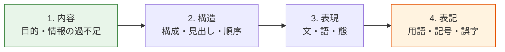

# レビュー

## この章の目的

**「なぜダメか」と「どう直すか」を言えるようになる。**

「読みにくいです」は指摘ではない。指摘とは、**直す場所が特定でき、直したかどうかを判定できる**ものである。

---

## 結論

レビューで言うべきことは、次の4つを埋めた形である。

> **〈品質軸〉＋〈現状〉＋〈読者への影響〉＋〈直す方向〉**

| 悪い指摘 | 良い指摘 |
|---|---|
| 読みにくいです | 〈明確性〉この一文には主題が3つ入っています。読者は句点まで3つを記憶し続けることになり、読み返しが必要になります。主題ごとに文を分けてください |
| 分かりません | 〈明確性〉「エビデンス」が証跡と根拠のどちらを指すか、この文からは決まりません。読者は何を添付すればよいか判断できません。具体的に何を求めているか書いてください |
| もっと簡潔に | 〈明確性〉冒頭の文が106字で、件名と同じ内容を繰り返しています。読者は要点にたどり着くまでに2回同じ話を読みます。件名で言ったことは省いてください |

**「どう直すか」は方向だけを示す。書き換え案そのものは書かない。** 理由は後述する。

---

## R-01 推敲を済ませてからレビューに出す

**規範度: 必須**

**なぜ**: 自分で見つけられるミスをレビューに出すと、レビュアーの時間がそこで消える。本当に見てほしい構成やロジックまで届かない。

`SRC-WRITE-003` 2.8 が示す推敲の方法は具体的である。

1. **仕上がりより3割程度多めに書く。** そこから削る。
2. **最低2回見直す。** 1回では冗長さは取れない。
3. **1日置いてから2回目を見る。** 時間を置くと自分の文章を客観的に読める。

> プロであっても、1 回でスッキリとした簡潔な文章を書けるものではありません。

2回の推敲で見る点（`SRC-WRITE-003` 2.8）

- [ ] 情報の漏れがないか
- [ ] 文と文のつながりは読みやすいか
- [ ] 接続詞が効果的に使われているか
- [ ] 件名やタイトルとずれていないか

**出典**: `SRC-WRITE-003` 2.8

---

## R-02 大きい単位から小さい単位へ見る

**規範度: 必須**

**なぜ**: 誤字を直したあとに章立てを変えると、直した作業が無駄になる。**手戻りを防ぐために順序がある。**



`SRC-WRITE-003` 3.7 のレビューチェックリストは、この順に並んでいる。

| 順 | 観点 | 段階 |
|---|---|---|
| 1 | タイトルから文章の目的が伝わる | 内容 |
| 2 | 全体の構成がロジカルに組み立てられている | 構造 |
| 3 | ロジックが見出しからわかるように書かれている | 構造 |
| 4 | 文と文のつながりがある | 構造 |
| 5 | 必要な情報が盛り込まれている | 内容 |
| 6 | 不要な情報が書かれていない | 内容 |
| 7 | 一文が長過ぎない。50字以下を目安に短く書いている | 表現 |
| 8 | 話し言葉でなく、書き言葉で書いている | 表現 |
| 9 | 敬語表現が適切に書かれている | 表現 |
| 10 | 表記の揺れがない | 表記 |
| 11 | 固有名詞が間違っていない | 表記 |
| 12 | 誤字、脱字がない | 表記 |

**表記の指摘から始めてはいけない。** そこは `doc_lint` に任せる（[05-presentation.md](05-presentation.md)、[tools/doc_lint.py](../tools/doc_lint.py)）。人間は内容と構造を見る。

**出典**: `SRC-WRITE-003` 3.7

---

## R-03 指摘には必ず理由を書く。書き換え案は書かない

**規範度: 必須**

**なぜ**: `SRC-WRITE-003` 3.7 は、この点をはっきり述べている。

> 修正すべき点は、どのように直すのか書き換え案を示すのではなく、なぜ、伝わらないのか理由を書き込みましょう。具体的に理由を書くことが重要です。単に「わからない」と書き入れても、内容がわからないのか、文章がわかりにくいのか、書き手には判断できず、修正の方針が立てられません。

**書き換え案を出すと、2つの害がある。**

1. **書き手が学ばない。** 次も同じ書き方をする。
2. **レビュアーが内容を誤解したまま代筆する。** 書き手しか知らない事情が消える。

**では何を書くか。「どのような修正をしたらよいのか、方向性が見えるコメント」である。**

| 種類 | 書く | 書かない |
|---|---|---|
| 理由 | 「主題が3つ入っているため、句点まで記憶が必要」 | — |
| 方向 | 「主題ごとに文を分けてください」 | — |
| 書き換え案 | — | 「〜と書き換えてください」 |

**例外**: 書き手が新人で、方向を示しても直せない場合。その場合も**まず理由を書き、そのあとに例として案を添える。** 案だけを渡さない。

**出典**: `SRC-WRITE-003` 3.7

---

## R-04 良い点も書く

**規範度: 推奨**

**なぜ**: `SRC-WRITE-003` 3.7 は、コメントを2種類に分けている。

> コメントは 2 種類。よく書けている箇所にポジティブフィードバックを入れることと、修正したほうがよい箇所に具体的な指摘を入れることが重要です。
> ポジティブフィードバックを入れることで、書き手は「この箇所は、このような書き方で伝わっているのだ」という実感がわき、自信をもつことにつながります。

**これは気遣いのためではない。** 書き手は、何が伝わったかを知らないと、次に何を残すべきか判断できない。**削ってはいけない書き方を教えるのが、良い点の指摘である。**

**出典**: `SRC-WRITE-003` 3.7

---

## R-05 前提の異なる人にレビューしてもらう

**規範度: 推奨**

**なぜ**: 同じ知識を持つ人だけでは、無意識の省略に気づけない。書き手が「当然知っている」と思って省いたことは、同じチームの人も当然だと思う。

`SRC-WRITE-004` 2-5 は、対策を2つ挙げている。

1. 前提の異なる人にレビューしてもらう
2. 読み手別のチェック表を使う

**出典**: `SRC-WRITE-004` 2-5

---

## R-06 重大度を付ける

**規範度: 必須**

**なぜ**: すべての指摘が同じ重みに見えると、書き手は誤字と設計の欠落を同列に扱う。**直す順序が決まらない。**

| 重大度 | 判断基準 | 完了への影響 |
|---|---|---|
| **Blocker** | 誤った作業を招く、事実が誤っている、判断に必要な情報が欠けている | 必ず止める |
| **Major** | 主要な読者が目的を達成できない、構成が破綻している | 修正後に再レビュー |
| **Minor** | 限定的な不備。明確性や保守性の不足 | 原則修正。延期する場合は理由を記録 |
| **Note** | 将来の改善、質問、参考情報 | 判定を妨げない |

この分類は、社内の成果物品質基準（`triad-orchestrator/docs/knowledge/artifact-quality-standard.md`）と揃えている。

**出典**: 社内の成果物品質基準。書籍側に対応する記述は無い（**出典なし・運用上の取り決め**）。

---

## R-07 好みと規約を区別して言う

**規範度: 必須**

**なぜ**: 規約に無いことを規約のように言うと、書き手は従うしかなくなる。レビューが個人の好みの押し付けになる。

**言い方を分ける。**

| 種類 | 言い方 |
|---|---|
| 規約にある | 「S-13（文体を統一する）に反しています」 |
| 規約に無いが根拠がある | 「規約にはありませんが、`SRC-EXT-002` によれば走査する読者は79%です。見出しを足すことを勧めます」 |
| 単なる好み | **「これは私の好みですが、〜の方が読みやすいと感じます」と明示する** |

**好みを言ってはいけないのではない。好みだと明示せずに言ってはいけない。**

**出典**: **出典なし・私見**。ただし `SRC-WRITE-003` 3.7 の「レビューの観点や方針を共有しておく」という指針と整合する。

---

## R-08 レビューは短時間で区切る

**規範度: 任意**

**なぜ**: `SRC-WRITE-003` 3.7 は、研修での実践としてこう述べている。

> 筆者のライティング研修では、3 分、または 2 分と区切ってコメントを 1 箇所以上書き入れることをルールとして、相互レビューを実施します。多くの人が複数のコメントを書き入れます。

**レビューは長時間かける作業ではない。** 短く区切ると、かえって重要な点に集中できる。

また、レビューする側にも利益があると述べている。

> 他の人の文章をレビューしてコメントを書き入れることは、文章力向上につながります。

**出典**: `SRC-WRITE-003` 3.7

---

## 指摘の言語化テンプレート

指摘を書くときの型と、品質6軸ごとの言い方をまとめる。**「読みにくい」と言いそうになったら、この表から選ぶ。**

### 型

```text
〈品質軸〉現状の記述。
読者への影響。
直す方向。
```

### 品質軸ごとの言い方

6軸（[01-what-is-good.md](01-what-is-good.md#品質の6軸)）ごとに、よくある症状と言い方をまとめる。**「読みにくい」と言いそうになったら、この表から選ぶ。**

| 軸 | 症状 | 言い方の例 |
|---|---|---|
| **有用性** | 読者が決まっていない | 〈有用性〉想定読者が「関係者」となっており、前提知識が定まりません。運用担当者向けなのか開発者向けなのかで、必要な説明が変わります。主たる読者を1つに決めてください |
| **有用性** | 読後の行動が示されていない | 〈有用性〉この文書を読んだあと読者が何をするのかが書かれていません。読者は読み終えても行動できません。冒頭に「読んだあと〇〇ができる」を書いてください |
| **発見容易性** | 結論が最後にある | 〈発見容易性〉結論が3ページ目にあります。読者の79%は走査するため、途中で読むのをやめた人には要点が伝わりません。結論を冒頭に移してください |
| **発見容易性** | 見出しが抽象的 | 〈発見容易性〉見出し「その他」から中身が予測できません。走査する読者はこの節を飛ばします。何が書いてあるかを具体的に書いてください |
| **正確性** | 事実と意見が混ざっている | 〈正確性〉「〜と思われるため」以降が推定なのか確認済みなのか区別できません。読者は未検証の対策を確定事項として扱う恐れがあります。事実・推定・対策案をラベルで分けてください |
| **正確性** | 曖昧語で条件が決まらない | 〈正確性〉「速やかに」が具体的な期限を示していません。読者ごとに解釈が変わり、期限を過ぎる恐れがあります。年月日と時刻で書いてください |
| **明確性** | 一文に主題が複数 | 〈明確性〉この一文には主題が3つ入っています。読者は句点まで3つを記憶し続けることになります。主題ごとに文を分けてください |
| **明確性** | 係り受けが決まらない | 〈明確性〉「急いで」が「逃げる」と「追いかけた」のどちらに係るか決まりません。読点の位置で確定させてください |
| **明確性** | 動作主が無い | 〈明確性〉「調整します」の主語がありません。誰が調整するか決まらないと作業が止まります。動作主を書いてください |
| **明確性** | 定義のない語 | 〈明確性〉「巻き取る」の意味がこの文書で定義されていません。読者によって解釈が変わります。定義するか、具体的な動作に書き換えてください |
| **一貫性** | 用語の揺れ | 〈一貫性〉同じ対象が「ユーザー」「利用者」「顧客」と3通りで呼ばれています。読者は別のものだと考える恐れがあります。1つに統一してください |
| **一貫性** | 文体の混在 | 〈一貫性〉本文に敬体と常体が混在しています。書き手が変わったように読めます。どちらかに統一してください |
| **保守性** | 最終確認日が無い | 〈保守性〉最終確認日と保守責任者がありません。読者はこの情報がいつ時点のものか判断できません。冒頭に追加してください |
| **保守性** | 時点に依存する語 | 〈保守性〉「現在は未対応です」の「現在」がいつを指すか、時間が経つと分からなくなります。版数か日付で書いてください |

---

## レビュー観点チェックリスト

印刷して使える形は [appendix-checklist.md](appendix-checklist.md) にある。

### 内容（最初に見る）

- [ ] 主たる読者が1つに決まっているか
- [ ] 読後の行動が一文で書かれているか
- [ ] タイトルから目的が伝わるか
- [ ] 必要な情報が盛り込まれているか
- [ ] 不要な情報が書かれていないか
- [ ] 事実と意見（推定）が区別されているか
- [ ] 扱わないことが書かれているか

### 構造（次に見る）

- [ ] 結論が先に書かれているか
- [ ] 見出しだけを読んで筋が通るか
- [ ] 見出しから中身が予測できるか
- [ ] 情報の型（手順・説明・事実・注意）が混ざっていないか
- [ ] 条件が指示の前に置かれているか
- [ ] 一度に示す項目が絞られているか（3つ / 7項目 / 10ステップ）

### 表現（そのあと）

- [ ] 一文に主題が1つか
- [ ] 動作主が明示されているか
- [ ] 曖昧語が数値・固有名詞・日時に置き換わっているか
- [ ] 二重否定が無いか
- [ ] 読者が知らない語が定義されているか

### 表記（最後。`doc_lint` に任せる）

- [ ] 用語が統一されているか
- [ ] 文体が統一されているか
- [ ] 見出しの階層が飛んでいないか
- [ ] 固有名詞が正しいか
- [ ] 誤字脱字が無いか

---

## この章のルール一覧

| ID | ルール | 規範度 |
|---|---|---|
| R-01 | 推敲を済ませてからレビューに出す | 必須 |
| R-02 | 大きい単位から小さい単位へ見る | 必須 |
| R-03 | 指摘には必ず理由を書く。書き換え案は書かない | 必須 |
| R-04 | 良い点も書く | 推奨 |
| R-05 | 前提の異なる人にレビューしてもらう | 推奨 |
| R-06 | 重大度を付ける | 必須 |
| R-07 | 好みと規約を区別して言う | 必須 |
| R-08 | レビューは短時間で区切る | 任意 |
