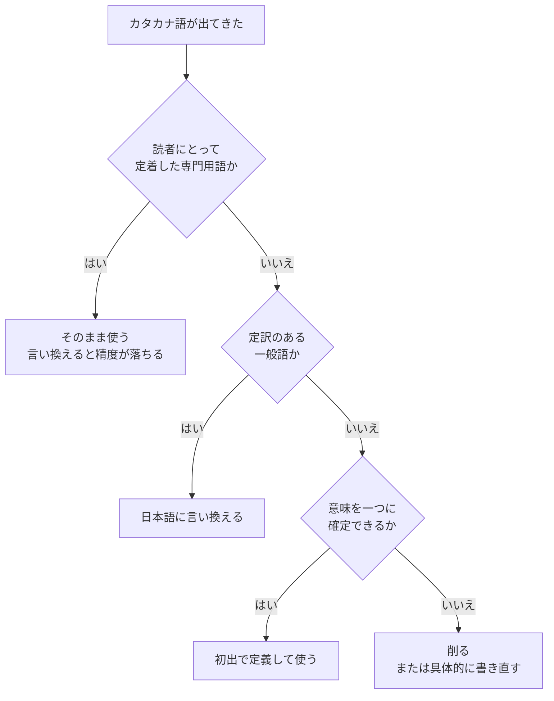

# あなたの直感は正しいか

## この章の目的

多くの人は「読みやすい文書」について自分なりの好みを持っている。**その好みが、根拠のある原則なのか、単なる癖なのかを見分ける。**

ここでは、実際に挙げられた4つの好みを検証する。それぞれについて、支持する出典、反対する出典、そして**本当の理由**を示す。

## 結論

**4つとも方向は正しい。ただし、3つは理由が本人の説明と違う。** 理由が違うと、直し方も違ってくる。

| # | 好み | 判定 | 支持する出典数 |
|---|---|---|---|
| 1 | 一文が長いのが嫌い | 支持。ただし理由が違う | 5 |
| 2 | 難しい言葉が嫌い | 支持 | 6 |
| 3 | 横文字（カタカナ語）が嫌い | **部分的に支持。考えを変える必要がある** | 4 |
| 4 | 一つの見出しの下が長いのが嫌い | 支持 | 7 |

---

## 1. 一文が長いのが嫌い

### 判定: 支持する。ただし、問題は長さではない

支持する出典は `SRC-WRITE-001`、`SRC-WRITE-003`、`SRC-WRITE-004`、`SRC-EXT-001`、`SRC-EXT-002` の5つである。

### 本当の理由: 読者に記憶を強いる時間が長いから

`SRC-WRITE-003` 2.1 は、人が文を読む仕組みから説明している。

> 人が文章を読むときには、句点「。」を区切りとして読み進めていきます。区切りがきたときに、「この文では、このような内容が書いてあった」と整理できると、スムーズに文章を読み進めることができ（中略）一方、複数の内容が盛り込まれている文は、区切りがどこになるのかを考え、それぞれの内容を整理しながら読み進めなければなりません。

`SRC-WRITE-001` は聞き手の側から説明する。**聞き手は文が終わるまで、途中の語と語の関係を記憶し続ける。** 文末まで来て、ようやく消化できる。情報が追加され続けると、記憶が保たなくなる。

**つまり、負担をかけているのは字数ではなく、決着がつかない状態の長さである。**

### だから、直し方が変わる

| 問題の見方 | 出てくる直し方 | 結果 |
|---|---|---|
| 「長いから悪い」 | 適当なところで切る | 意味のつながりが切れる。かえって読めなくなる |
| 「主題が複数あるから悪い」 | 主題ごとに切る | 各文が独立して理解できる |

### 実例

`SRC-WRITE-003` 2.1 が挙げている例である。

**Before（複数の内容が一文に入っている）**

```text
「HRTN CLOUD」はクラウド型ビジネスコミュニケーションツールで、ファイル管理、
プロジェクト管理、メッセンジャー、グループチャット機能をもっているため、資料や
プロジェクトの情報を共有し、コミュニケーションの迅速化を図ることができます。
```

**After（一文一義に分けた）**

```text
「HRTN CLOUD」はクラウド型ビジネスコミュニケーションツールです。
ファイル管理、プロジェクト管理、メッセンジャー、グループチャットなどの機能があります。
資料やプロジェクトの情報を共有し、コミュニケーションの迅速化を図ることができます。
```

**切った位置に注目してほしい。** 「〜で、」「〜ため、」という接続で3つの主題がつながっていた。切った先はこの3か所である。字数で切ったのではない。

### 50字という数字について

`SRC-WRITE-003` 2.3 は「一文50字以内」を目安として挙げ、106字の例を49字に直して見せている。

```text
▶ BEFORE  1文が長い例（106字）
チャットやメッセンジャー機能は、個人のユーザーを中心にネット時代の新しいコミュニ
ケーションツールとして普及していますが、データ管理面やセキュリティーの面で企業で
の利用には不安な点もあると考えられているのが実情です。

▶ AFTER  1文を短くした例（49字）
チャットやメッセンジャー機能のビジネス利用は、データ管理やセキュリティーの面から
不安視されています。
```

ただし、**この数値を挙げているのは1出典だけである。**

| 出典 | 一文の長さの基準 |
|---|---|
| `SRC-WRITE-003` | 50字以内 |
| `SRC-WRITE-004` | 短くせよ。上限は示していない |
| `SRC-EXT-001`（Google） | 数値基準なし。「1文1アイデア」で判断 |
| `SRC-EXT-003`（JTF） | 規定なし。作文技術は扱わないと明言 |

**したがって、この標準では「一文一義」を必須にし、50字は目安として扱う。**

### 注意すべき反例

短くすることには害もある。出典自身が2か所で警告している。

> 簡潔な文というのは、内容がない短い文とは異なります。読み手と目的に合わせて情報を整理して、不要な情報が入っていない文です。（`SRC-WRITE-003` コラム）

> 書き手と読み手の双方が既知の内容以外は、むやみに省略するな。（`SRC-WRITE-004` 2-5）

**短くするために情報を削ると、正確性を損なう。** 短さと省略は別物である。削るのは冗長な言い回しであって、読者が必要とする情報ではない。

もう一つの害は、**接続が失われること**である。短文を並べただけの文章は、文と文の関係が読者に見えなくなる。`SRC-WRITE-003` 2.7 は接続詞を最小限にせよと言うが、これは「使うな」ではなく「効果的に使え」という意味である。

---

## 2. 難しい言葉が嫌い

### 判定: 支持する

支持する出典は `SRC-WRITE-001`、`SRC-WRITE-003`、`SRC-WRITE-004`、`SRC-EXT-001`、`SRC-EXT-003`、`SRC-EXT-006` の6つである。**この標準のなかで最も広く支持されている好みである。**

### 本当の理由: 1語の詰まりが、そのあと全部を止めるから

`SRC-WRITE-001` の説明が最も鋭い。

> 知らない単語が一つあるだけで、その後の説明が入らなくなる。

これは「少し読みにくくなる」という話ではない。**読者はそこで止まる。** 止まったあとの文章は、正しく書かれていても届かない。

### 判断に迷ったときの既定

`SRC-EXT-003`（JTF日本語標準スタイルガイド 第4.0版）は、迷ったときの既定を明示している。

> 漢字かひらがなかで表記に迷う場合は、ひらがな書きを活用します。

さらに、**常用漢字表にあっても、ひらがなで書く語の一覧**を挙げている。

<!-- doclint-disable open_in_hiragana -->

| ひらがなで書く | 使わない |
|---|---|
| あらかじめ | 予め |
| したがって（接続詞） | 従って |
| または | 又は |
| ただし | 但し |
| さらに | 更に |
| もしくは | 若しくは |
| ください | 下さい |
| できる | 出来る |
| こと（形式名詞） | 事 |
| とき（形式名詞） | 時 |

<!-- doclint-enable -->

**「漢字で書けること」と「漢字で書くべきこと」は別である。** この一覧は、そのまま自動チェックの辞書として使える（[doc_lint](../tools/doc_lint.py) に実装している）。

### これは好みではなく、制度である場合がある

`SRC-EXT-006` によれば、米国では **Plain Writing Act of 2010** により、公衆向けの文書を対象読者に合わせて書くことが法的要件になっている。

> "Not only is plain language more efficient and effective. It is also the law."

平易に書くことを「やさしさ」や「気配り」の問題だと考えると、忙しいときに真っ先に切り捨てられる。**これは正確に伝わるかどうかの問題である。**

### 例外: 平易にできない語がある

正確さを保つために、平易にできない語がある。その場合の扱いは3つである。

1. 初出で定義する。
2. 用語集に載せてリンクする。
3. その語を使わずに済む書き方に変える。

**やってはいけないのは、定義せずに使うことである。**

---

## 3. 横文字（カタカナ語）が嫌い

この項目だけは、出典が依頼者と反対を向いている。判定と、その理由を順に示す。

### 判定: 部分的に支持する。ただし、ここは考えを変える必要がある

**4つの好みのうち、唯一、出典が正面から反対している項目である。**

### 出典が反対していること

`SRC-WRITE-003` 4.8 は、はっきりこう書いている。

> 結論から言えば、ニュースや新聞で扱われる一般的な用語は、カタカナ表記にするとよいでしょう。読み手にとって、読み取りやすく、理解しやすくなります。英字表記が正しいからといってカタカナ表記を併記しないと、読み手はどう読んでいいのかわからないかもしれません。**日本語の文章に英字が多く入ると読みにくくなります。**

同じ節の例を見ると、主張がはっきりする。

```text
・英字表記にした例
「FinTech」とは、Finance と Technology を組み合わせた…

・カタカナ表記にした例
「フィンテック」とは、ファイナンス（金融）とテクノロジー（技術）を組み合わせた…
```

**カタカナは、英字より読みやすい側にある。** 「カタカナを減らす」という方向で直すと、英字が増えて、かえって読みにくくなる。

`SRC-EXT-001`（Google）の基準はさらに明快である。

> "It can be valuable to include jargon in a document when you know that readers search for those terms."

**読者がその語で検索するなら、その語を使う。** 「デプロイ」を「配備」に書き換えると、読者は検索できなくなり、他の資料やエラーメッセージと用語がつながらなくなる。**平易にしたつもりで、実は読者を孤立させている。**

### 正しい判断軸

問題は「カタカナかどうか」ではない。**読者にとって一意に読めるかどうか**である。



### 3つに分けて扱う

| 種類 | 例 | 扱い | 理由 |
|---|---|---|---|
| **定着した専門用語** | デプロイ、キャッシュ、コミット、マージ、ロールバック | **使う** | 言い換えると精度が落ちる。読者はこの語で検索する |
| **定訳がある一般語** | アジェンダ→議題、コンセンサス→合意、アサイン→割り当て | **言い換える** | 情報量が増えないのに、読者を選ぶ |
| **意味が定まらない語** | エビデンス、巻き取る、握る、なるはや | **定義するか削る** | 書き手と読者で意味が違う |

### 「エビデンス」が典型例

この語は、文脈によって「証跡」にも「根拠」にもなる。**日本語に直そうとして訳語が2つ出てくること自体が、この語が曖昧である証拠である。**

**Before**

```text
エビデンスを添えて報告してください。
```

**After（証跡の意味なら）**

```text
実行時のログとスクリーンショットを添えて報告してください。
```

**After（根拠の意味なら）**

```text
その判断の根拠となった測定値を添えて報告してください。
```

言い換えた結果、**何を添えればよいかが決まった。** これが「一意に読める」ということである。

### あなたが本当に嫌っているもの

以上を踏まえると、嫌悪の対象は「カタカナ」ではなく、おそらく**3番目の種類**である。意味が定まらないまま雰囲気で使われる語。それは正しく嫌ってよい。**ただし「カタカナだから」という理由で削ると、1番目まで巻き添えになる。**

---

## 4. 一つの見出しの下が長いのが嫌い

この項目は最も多くの出典に支持されている。ただし、細かく割りすぎる害もある。

### 判定: 支持する

支持する出典は `SRC-WRITE-002`、`SRC-WRITE-003`、`SRC-WRITE-004`、`SRC-EXT-001`、`SRC-EXT-002`、`SRC-EXT-003`、`SRC-EXT-005` の7つである。**最も多くの出典が支持している。**

### 本当の理由: 読者は最初から順に読まないから

`SRC-EXT-002`（Nielsen Norman Group）の実測値である。

| 測定項目 | 数値 |
|---|---|
| 新しいページを**必ず走査する**読者 | **79%** |
| **1語ずつ読む**読者 | **16%** |

書き方を変えたときの効果も測られている。

| 変更内容 | ユーザビリティの改善 |
|---|---|
| 簡潔にする | **+58%** |
| 走査しやすい体裁にする | **+47%** |
| 客観的な言葉にする | **+27%** |
| 3つすべて | **+124%** |

**読者の8割は走査している。** 長い塊は、その8割にとって「入口が無い壁」である。

### 数値の目安

| 対象 | 目安 | 出典 |
|---|---|---|
| 段落の文数 | 3〜5文。7文を超えない | `SRC-EXT-001` |
| 箇条書きの項目数 | 7項目以内 | `SRC-WRITE-003` 4.7 |
| 一度に示すポイント | 3つまで | `SRC-WRITE-001` 第2章 |
| 見出しの階層 | 章・節・項の3階層程度まで | `SRC-WRITE-003` 4.6 |

`SRC-WRITE-003` は7項目の根拠を明示している。

> これはマジックナンバー7 と呼ばれるもので、認知心理学の観点から、人が一度に把握できる項目数は平均7つと考えられているからです。

### ただし、細かく割りすぎる害もある

**ここは見落とされやすい。** 出典は両側から警告している。

| 出典 | 警告 |
|---|---|
| `SRC-EXT-001` | 一文だけの段落を多用しない（"don't use excessive one-sentence paragraphs"） |
| `SRC-WRITE-003` 4.6 | 深い階層は、項目間の関係と全体像を把握しにくくする |

細かく割ると、次の3つが起きる。

1. **目次が使えなくなる。** 見出しが50個あるページの目次は、目次として機能しない。
2. **文書の筋が消える。** どこからどこまでが一つの話なのかが分からなくなる。
3. **どこに何を書けばよいか分からなくなる。** 書き手にとっても保守できない。

### 正しい基準は行数ではない

> **1つの見出しの下に、1つのトピックだけがあるか。**

長いと感じたときにやることは、行数を数えることではない。**中に何個のトピックが入っているかを数えることである。**

| 中身 | 判断 |
|---|---|
| トピックが1つで、長い | そのままでよい。分けるとかえって分かりにくい |
| トピックが2つ以上ある | 分ける。見出しも2つになる |
| トピックが1つで、余計な情報が混ざっている | 分けるのではなく、削る |

**「長い」は症状であって、原因ではない。** 原因を見ずに分けると、関係のある話が2か所に散る。

---

## まとめ

| 好み | 正しい言い換え |
|---|---|
| 一文が長いのが嫌い | **一文に主題が複数あるのが嫌い** |
| 難しい言葉が嫌い | そのまま正しい。迷ったらひらがなで開く |
| 横文字が嫌い | **読者にとって一意に読めない語が嫌い** |
| 見出しの下が長いのが嫌い | **一つの見出しの下にトピックが複数あるのが嫌い** |

**3つとも、言い換えると「単位が守られていないのが嫌い」になる。** 一文に1主題、一見出しに1トピック、一語に1意味。好みの正体はこれである。

この見方に立つと、レビューでの言い方も変わる。

- 「長いです」ではなく「この文には主題が3つ入っています」。
- 「横文字が多いです」ではなく「この語は読者によって意味が変わります」。
- 「読みにくいです」ではなく「この見出しの下にトピックが2つあります」。

**どれも、直す場所が特定できる指摘になっている。** 指摘の言語化については [06-review.md](06-review.md) で扱う。
