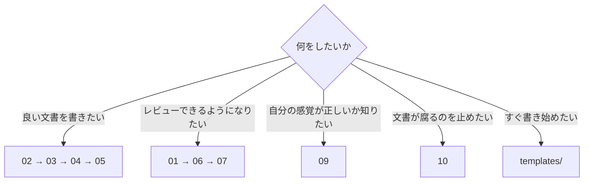

# エンジニアのためのドキュメント標準

| 項目 | 内容 |
|---|---|
| 想定読者 | システム開発で設計書・手順書・報告書・議事録を書く人。および、それらをレビューする人 |
| この文書を読んだあとできること | 質の高い文書を書ける。レビューで「なぜダメか」と「どう直すか」を説明できる |
| 保守責任者 | このリポジトリの保守担当 |
| 最終確認日 | 2026-08-28 |

## この標準は何か

**読者が用を足せる文書を書くための、根拠つきのルール集である。**

書籍4冊と、公開されている標準・実験結果6件を突き合わせた。**中核となる原則は、独立した3出典以上が直接支持するものに限った。**

ただし、**出典数と規範度は別の軸である。** 単一の出典にしか根拠が無くても、守らないと読者に実害が出るルールは必須にしている。その場合は出典欄が1件であることから読み取れる。詳しくは [01-what-is-good.md](01-what-is-good.md#出典数と規範度は別の軸である) にある。

出典が無いルール（R-06、R-07、O-05、O-07）は、この標準が運用上決めたものである。各ルールにその旨を明記している。

出典と支持数の突き合わせは [research/cross-reference.md](../research/cross-reference.md) にある。

## どこから読むか



| 目的 | 読む順 |
|---|---|
| 良い文書を書けるようになりたい | [02](02-before-writing.md) → [03](03-structure.md) → [04](04-sentences.md) → [05](05-presentation.md) |
| レビューで指摘できるようになりたい | [01](01-what-is-good.md) → [06](06-review.md) → [07](07-antipatterns.md) |
| 自分の「読みやすさ」の感覚が正しいか確かめたい | [09](09-your-instincts.md) |
| 文書が古くなるのを防ぎたい | [10](10-operations.md) |
| いま書く文書の型がほしい | [08](08-templates.md) |
| 手元に1枚置きたい | [appendix-checklist.md](appendix-checklist.md) |

## 章の一覧

| 章 | 内容 |
|---|---|
| [01 良い文書とは何か](01-what-is-good.md) | 品質6軸、規範の強さ、数値の扱い、自動チェックの限界 |
| [02 書き始める前に決めること](02-before-writing.md) | 読者、目的、文書の型、範囲、保守責任 |
| [03 構成のルール](03-structure.md) | 結論先出し、見出し、階層、情報の型を混ぜない |
| [04 文のルール](04-sentences.md) | 一文一義、動作主、曖昧語、用語、表記 |
| [05 見せ方のルール](05-presentation.md) | 箇条書き、表、図、コード、Markdown |
| [06 レビュー](06-review.md) | 推敲の順序、指摘の言語化、重大度 |
| [07 アンチパターン集](07-antipatterns.md) | 25件の Before / After |
| [08 文書型テンプレート](08-templates.md) | README、設計書、手順書、障害報告など8種 |
| [09 あなたの直感は正しいか](09-your-instincts.md) | 「短い文がよい」「横文字は嫌い」などの検証 |
| [10 運用](10-operations.md) | docs as code、最終確認日、消すこと |
| [ADR-001 図の作り方](adr/ADR-001-diagram-tool.md) | Mermaid / draw.io / 手書きSVG の使い分け |

## この標準の要点

急いでいる人のための要約である。

1. **良い文書とは、読者が必要な判断と行動を、最小の労力で、正しく行える文書である。** 美しさでも網羅性でもない。
2. **読者は最初から順に読まない。** Webページの実験では79%が走査し、1語ずつ読んだのは16%だった（`SRC-EXT-002`）。数値はWebページの測定である。
3. **文を直す前に、読者・目的・文書の型を決める。** ここが決まっていない文書は、文をいくら磨いても良くならない。
4. **「読みにくい」は指摘ではない。** 品質6軸のどれに当たるかを言うと、直す場所が決まる。
5. **数値（50字、7項目、3階層）は目安であって合否の基準ではない。** すべて単一出典に由来する。
6. **自動チェックを通ったことは品質の証明ではない。** 読者適合、結論の妥当性、事実の正しさは機械では判定できない。

## この文書自身が、どのルールをどう守っているか

**標準が自分を守れていないなら、その標準は使えない。** 実際にどうなっているかを書く。

### この標準は「1つの文書」として扱う

`docs/` 配下の各章は、独立した文書ではない。**全体で1つの文書であり、メタ情報（発信日・作成者・想定読者・保守責任者・最終確認日）はこのページが持つ。**

各章に同じメタ情報の表を置くと、O-04（同じことを2つの文書に書かない）に反し、更新のたびに14か所を直すことになる。

**一方、`templates/` の各ファイルは独立した文書である。** そのため、それぞれがメタ情報を持つ。`doc_lint` の `document_metadata` は、この区別に従って検査する。

### 守っていること

| ルール | この文書での実装 |
|---|---|
| B-01 読者を決める | 冒頭の表で想定読者を明示している |
| B-02 読後の行動を書く | 同じ表に「読んだあとできること」を書いている |
| B-05 最終確認日を持つ | 冒頭の表にある |
| C-02 見出しを具体的にする | 「その他」「補足」を使っていない |
| C-08 文書の必須要素 | 冒頭の表が発信日・作成者・宛先を、h1 がタイトルを担う |
| O-01 docs as code | Markdown を正本とし、Git で管理し、`doc_lint` を通している |
| O-06 自動化 | [tools/doc_lint.py](../tools/doc_lint.py) が、ルールのうち機械判定できる分を検査する |
| 出典を示す | すべてのルールに出典IDを付けている。出典が無いものは「出典なし・運用上の取り決め」と書いている |

### 守れていないこと

**正直に書く。ここは独立レビューで指摘され、実物を確認して書き直した節である。**

| 問題 | 状況 |
|---|---|
| **04・07・08 章は「結論」から始まっていない** | それぞれ「この章の位置づけ」「この章の使い方」「使い方」で始まる。C-01 は文書の先頭に適用するルールであり、章はこの文書の一部である。**とはいえ、走査する読者には各章の冒頭にも要点が要る。未対応である** |
| 一文50字（S-02）を超える文がある | 定義文や、出典の主張を1文でまとめた箇所に多い。`doc_lint` は警告として報告する。**目安であって違反ではない**と本文に書いているとおりに扱っている |
| 自動チェックを抑制している箇所がある | 04・05・09・付録の用語集で、悪い例や表記の一覧を原文のまま載せるため。範囲と行数は `doc_lint --report-suppressions` で確認できる。**07 章にあった605行の一括抑制は、不要と分かったので外した** |
| 深い品質は検査していない | `SRC-EXT-004` の言う deep quality は測れない。この標準は機能的品質しか扱えていない |
| レビューの外部出典が1件取れなかった | Write the Docs のレビューのページが 404 だった。レビューの章は書籍2冊に依拠している |
| 扱えていない観点がある | 標準自身の版管理、機密情報の扱い、アクセシビリティ、コード例の継続検証。いずれも独立レビューで指摘された。**未着手である** |

## 検査の実行

```bash
docker run --rm --user "$(id -u):$(id -g)" -v "$PWD:/w" -w /w edocs-tools python tools/doc_lint.py
```

作業用のイメージは次で作る。ホストには何もインストールしない。

```bash
docker build -t edocs-tools -f tools/Dockerfile tools/
```

## 出典

| ID | 名称 | 種別 |
|---|---|---|
| `SRC-WRITE-001` | 大事な順に身につく 説明の「型」（海津佳寿美） | 書籍 |
| `SRC-WRITE-002` | ITエンジニアのためのMarkdown実践入門（平田賀一） | 書籍 |
| `SRC-WRITE-003` | 技術者のためのテクニカルライティング入門講座 第2版 | 書籍 |
| `SRC-WRITE-004` | エンジニアのための文章術 再入門講座 新版 | 書籍 |
| `SRC-EXT-001` | Google developer documentation style guide / Technical Writing Courses | 公開ガイド |
| `SRC-EXT-002` | Nielsen Norman Group（Webでの読まれ方の実証研究） | 実験結果 |
| `SRC-EXT-003` | JTF日本語標準スタイルガイド 第4.0版 | 公開標準 |
| `SRC-EXT-004` | Diátaxis | 公開枠組み |
| `SRC-EXT-005` | Write the Docs | 公開ガイド |
| `SRC-EXT-006` | RFC 2119 / 8174、ADR、Plain language | 公開標準 |

各出典の詳細は [research/external/](../research/external/) と [research/notes/](../research/notes/) にある。
